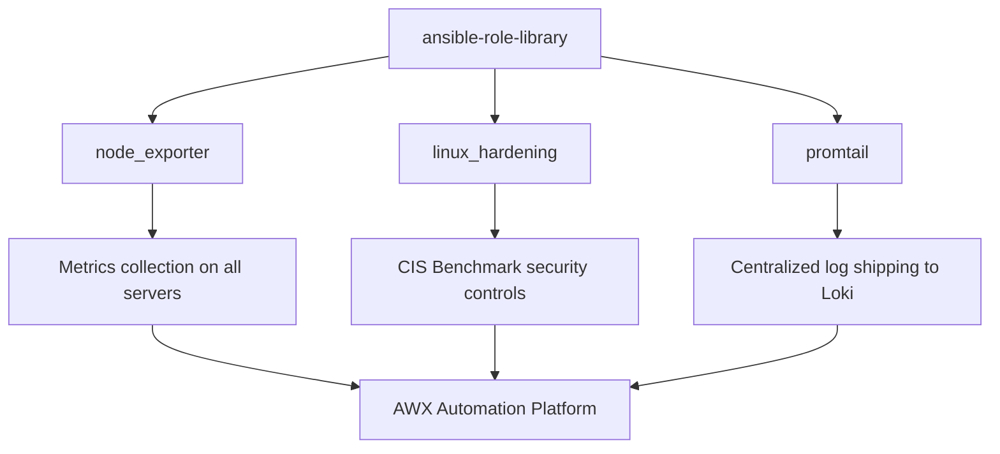

# Ansible Role Library

A collection of reusable, Galaxy-compatible Ansible roles built and tested
across a six-server Rocky Linux lab environment. Each role is self-contained,
fully documented, and deployable via AWX or the command line.

---

## Architecture



---

## Roles

| Role | Description | Origin Project |
| ---- | ----------- | -------------- |
| [node_exporter](roles/node_exporter/) | Deploy Prometheus node_exporter | Project 3 - Monitoring Stack |
| [linux_hardening](roles/linux_hardening/) | CIS Benchmark security hardening | Project 4 - Security Hardening |
| [promtail](roles/promtail/) | Deploy Grafana Promtail log agent | Project 5 - Log Management |

---

## Quick Start

Install all roles from this library:

```bash
ansible-galaxy install -r requirements.yml
```

Use a single role in a playbook:

```yaml
- name: Deploy monitoring agent
  hosts: servers
  become: yes
  roles:
    - node_exporter
```

Use multiple roles together:

```yaml
- name: Full server setup
  hosts: new_servers
  become: yes
  roles:
    - node_exporter
    - linux_hardening
    - promtail
```

See [examples/full_server_setup.yml](examples/full_server_setup.yml) for a complete example.

---

## Role Details

### node_exporter

Deploys Prometheus node_exporter as a systemd service. Handles binary
download, dedicated system user, firewall rules, and service verification.
Skips firewall configuration gracefully on hosts where firewalld is not running.

Key variables: `node_exporter_version`, `node_exporter_port`

### linux_hardening

Implements 12 CIS Benchmark controls across SSH, auditd, kernel parameters,
password policy, and service hardening. Includes SSH lockout protection —
verifies SSH key exists before disabling password authentication.

Key variables: `ssh_permit_root_login`, `password_min_length`

Supports tagged execution: `--tags ssh`, `--tags kernel`, `--tags auditd`

### promtail

Deploys Grafana Promtail agent to ship syslog, secure logs, and systemd
journal to a Loki endpoint. Uses persistent positions directory to survive
reboots without re-shipping logs.

Key variables: `loki_url`, `promtail_version`

---

## Compatibility

| Platform | Versions |
| -------- | -------- |
| Rocky Linux | 8, 9 |
| RHEL | 8, 9 |
| CentOS Stream | 8, 9 |

Minimum Ansible version: 2.9

---

## Testing

Each role includes a test inventory and playbook under `tests/`:

```bash
# Test node_exporter role
ansible-playbook roles/node_exporter/tests/test.yml \
  -i roles/node_exporter/tests/inventory

# Test linux_hardening role
ansible-playbook roles/linux_hardening/tests/test.yml \
  -i roles/linux_hardening/tests/inventory

# Test promtail role
ansible-playbook roles/promtail/tests/test.yml \
  -i roles/promtail/tests/inventory
```

---

## DevOps Skills Demonstrated

- Ansible role development following Galaxy standards
- Reusable infrastructure automation components
- Role metadata and Galaxy compatibility (meta/main.yml)
- Self-documenting roles with per-role README files
- Multi-role composition for complete server setup
- Tested across 6 Rocky Linux servers via AWX

---

## Part of DevOps Portfolio

- [Project 1 - Enterprise Infrastructure Automation Lab](https://github.com/proclaudio/enterprise-infrastructure-automation-lab)
- [Project 2 - CI/CD Push-to-Deploy Pipeline](https://github.com/proclaudio/cicd-push-to-deploy-pipeline)
- [Project 3 - Infrastructure Monitoring Stack](https://github.com/proclaudio/infrastructure-monitoring-stack)
- [Project 4 - Automated Security Hardening](https://github.com/proclaudio/automated-security-hardening)
- [Project 5 - Centralized Log Management](https://github.com/proclaudio/centralized-log-management)
- [Project 6 - Patch Management + Drift Detection](https://github.com/proclaudio/patch-management-drift-detection)
- [Project 7 - AWX RBAC + Team Management](https://github.com/proclaudio/awx-rbac-team-management)
- **Project 9 - Ansible Role Library** (this repo)
- Project 10 - GitLab CI Templates (coming soon)
- Project 8 - Kubernetes Platform Lab (coming soon)
